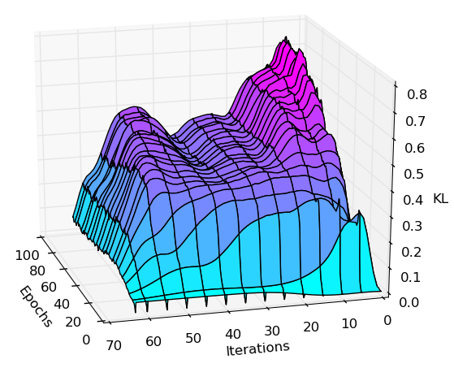

[](https://app.shippable.com/projects/557c82e6edd7f2c05214d9ce/builds/latest)
[](http://choosealicense.com/licenses/mit/)


Implementation of the DRAW network architecture
-----------------------------------------------
This repository contains a reimplementation of the Deep Recurrent Attentive
Writer (DRAW) network architecture introduced by K. Gregor, I. Danihelka,
A. Graves and D. Wierstra. The original paper can be found at

  http://arxiv.org/pdf/1502.04623


Dependencies
------------
 * [Blocks](https://github.com/bartvm/blocks) follow
the [install instructions](http://blocks.readthedocs.org/en/latest/setup.html).
This will install all the other dependencies for you (Theano, Fuel, etc.).
 * [Theano](https://github.com/theano/Theano)
 * [Fuel](https://github.com/bartvm/fuel)
 * [picklable_itertools](https://github.com/dwf/picklable_itertools)

Draw currently works with the "cutting-edge development version". But since the API is subject to change,
you might consider installing this known to be supported version:

You also need to install

 * [Bokeh](http://bokeh.pydata.org/en/latest/docs/installation.html) 0.8.1+
 * [ipdb](https://pypi.python.org/pypi/ipdb)
 * [ImageMagick](http://www.imagemagick.org/)


Data
----
You need to set the location of your data directory:

    export FUEL_DATA_PATH=/home/user/data

`fuel-download` and `fuel-convert` are used to obtain and convert training datasets. E.g. for binarized MNIST

    cd $FUEL_DATA_PATH
    fuel-download binarized_mnist
    fuel-convert binarized_mnist

or similarly for SVHN

    cd $FUEL_DATA_PATH
    fuel-download svhn -d . 2
    fuel-convert svhn -d . 2


Training with attention
-----------------------
To train a model with a 2x2 read and a 5x5 write attention window run

    cd draw
    ./train-draw.py --dataset=bmnist --attention=2,5 --niter=64 --lr=3e-4 --epochs=100

On Amazon g2xlarge it takes more than 40min for Theano's compilation to end and training to start. If you enable the bokeh-server, once training starts you can track its
[live plotting](http://blocks.readthedocs.org/en/latest/plotting.html).
It will take about 2 days to train the model.

After each epoch it will save the following files:

 * a pickle of the model
 * a pickle of the log
 * sampled output image for that epoch
 * animation of sampled output


Generating animations
---------------------

To generate sampled output including an animation run

```bash
python sample.py svhn_model.pkl --channels 3 --size 32
```

Note that in order to load a model and to generate samples all dependencies are
needed.  This unfortunately also this includes the GPU because python cannot
unpickle CudaNdarray objects without it. This is a [known
problem](http://stackoverflow.com/questions/25237039/converting-a-theano-model-built-on-gpu-to-cpu)
that we don't yet a have general solution to.


SVHN 
----

To train a model on SVHN

```bash
python train-draw.py --name=my_svhn --dataset=svhn2 \
  --attention=5,5 --niter=32 --lr=3e-4 --epochs=100 \
  --enc-dim 512 --dec-dim 512
```

After 100-200 epochs, the model above achieved a `test_nll_bound` of 1825.82.


Log
---

Run 
    
    python plot-kl.py [pickle-of-log]

to create a visualization of the KL divergence potted over inference iterations and epochs. E.g:

 


Testing
-------
Run 

    nosetests -v tests

to execute the testsuite. Run 

    cd draw
    ./attention.py

to test the attention windowing code on some image. It will open three windows:
A window displaying the original input image, a window displaying some
extracted, downsampled content (testing the read-operation), and a window
showing the upsampled content (matching the input size) after the write
operation.
